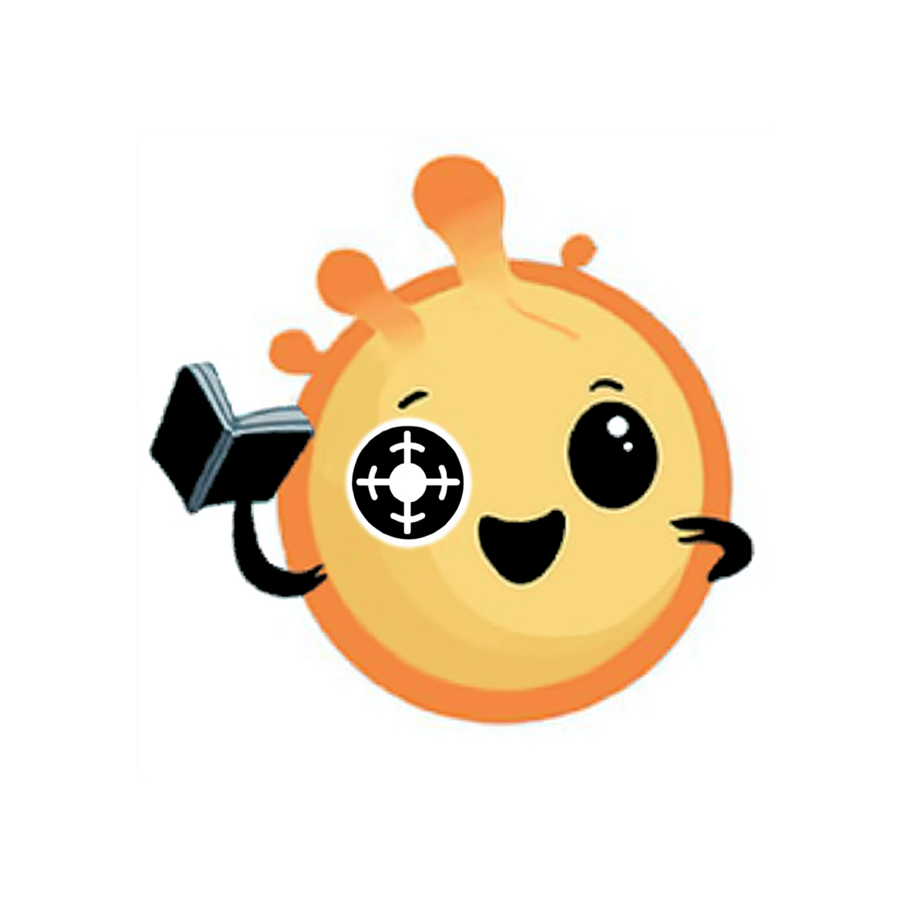
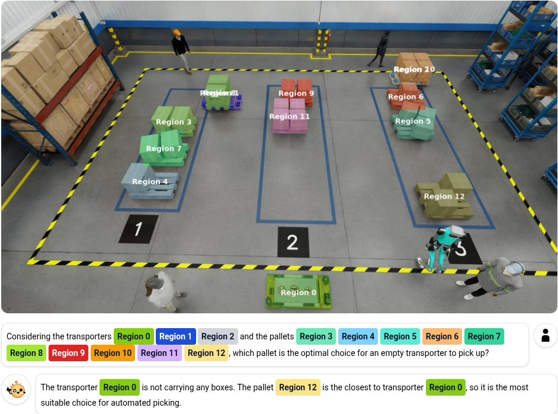

<p align="center">

</p>

## SmolRGPT: Efficient Spatial Reasoning for Warehouse Environments with 600M Parameters (ICCVW'25)



<p align="center">
  <font size="4">
    <b><a href="https://huggingface.co/collections/Abdrah/smolrgpt-checkpoints-6893bad56127440ef250486e">Checkpoints 🤗</a></b>&nbsp;&nbsp;&nbsp;
    <b><a href="https://huggingface.co/collections/Abdrah/smolrgpt-689399925331dfaddaf60bb2">Datasets 🤗</a></b>&nbsp;&nbsp;&nbsp;
    <b><a href="https://arxiv.org/abs/2509.15490">Paper 📄</a></b>
  </font>
</p>

## Abstract
Recent advances in vision-language models (VLMs) have enabled powerful multimodal reasoning, but state-of-the-art approaches typically rely on extremely large models with prohibitive computational and memory requirements. This makes their deployment challenging in resource-constrained environments such as warehouses, robotics, and industrial applications, where both efficiency and robust spatial understanding are critical. In this work, we present SmolRGPT, a compact vision-language architecture that explicitly incorporates region-level spatial reasoning by integrating both RGB and depth cues. SmolRGPT employs a three-stage curriculum to progressively align visual and language features, enables spatial relationship understanding, and adapts to task-specific datasets. We demonstrate that with only 600M parameters, SmolRGPT achieves competitive results on challenging warehouse spatial reasoning benchmarks, matching or exceeding the performance of much larger alternatives. These findings highlight the potential for efficient, deployable multimodal intelligence in real-world settings without sacrificing core spatial reasoning capabilities.

## Checkpoints (Optional)

You can directly use the model checkpoints by following intruction below:

### ICCVW'25 checkpoints
To download official ICCVW-2025 checkpoints:
```bash
wget https://huggingface.co/datasets/Abdrah/SmolRGPT-ICCV2025-Weights/resolve/main/weights.tar
tar -xvf weights.tar
```
Folder structure:
```bash
.
├── README.md
└── weights
    ├── best_lp_warehouse_nanoVLM_siglip2-base-patch16-256_mp2_SmolLM2-360M-Instruct_2xGPU_499083samples_bs112_ep20_lr5e-05-5e-05_0626-194812 # (Stage 3)
    │   ├── config.json
    │   └── model.safetensors
    ├── best_refiners_align_nanoVLM_siglip2-base-patch16-256_mp2_SmolLM2-360M-Instruct_2xGPU_1072510samples_bs224_ep1_lr5e-05-5e-05_0626-130100 # (Stage 2)
    │   ├── config.json
    │   └── model.safetensors
    └── best_rgb_align_nanoVLM_siglip2-base-patch16-256_mp2_SmolLM2-360M-Instruct_2xGPU_580491samples_bs240_ep20_lr5e-05-0.0001_0621-153415 # (Stage 1)
       ├── config.json
       └── model.safetensors
```


## Datasets

Download and place the dataset in `datasets`

### llava-CC3M

1. Git clone the dataset from HuggingFace using git LFS
```bash
git lfs install # Make sure git-lfs is installed (https://git-lfs.com)
git clone https://huggingface.co/datasets/Abdrah/llava-cc3m-smolRGPT
```
2. Download Llava-CC3M images and place them in the dataset folder:
```bash
cd llava-cc3m-smolRGPT
wget https://huggingface.co/datasets/liuhaotian/LLaVA-CC3M-Pretrain-595K/resolve/main/images.zip
unzip images.zip
``` 

### OSD-110K-SmolRGPT
1. Git clone the dataset from HuggingFace using git LFS
```bash
git lfs install # Make sure git-lfs is installed (https://git-lfs.com)
git clone https://huggingface.co/datasets/Abdrah/osd-110k-smolRGPT
```
2. Untar the RGB and Depth images:
```
cd osd-110k-smolRGPT
tar -xvf `depths.tar` 
tar -xvf `images.tar` 
```


### Spacial Warehouse Dataset

1. Git clone the dataset from HuggingFace using git LFS
```bash
git lfs install # Make sure git-lfs is installed (https://git-lfs.com)
git clone https://huggingface.co/datasets/Abdrah/warehouse-rgbd-smolRGPT
```
2. Download RGB and Depth images from the original repo:
```bash
# You can also use `huggingface-cli download`
git clone https://huggingface.co/datasets/nvidia/PhysicalAI-Spatial-Intelligence-Warehouse
cd PhysicalAI-Spatial-Intelligence-Warehouse

# Untar images for train/test subsets
for dir in train test; do
    for subdir in images depths; do
        if [ -d "$dir/$subdir" ]; then
            echo "Processing $dir/$subdir"
            cd "$dir/$subdir"
            tar -xzf chunk_*.tar.gz
            # rm chunk_*.tar.gz
            cd ../..
        fi
    done
done
```

## Training

### Stage I (RGB connector alignment)

```bash
python train.py --stage connector_alignment
or
torchrun --nproc-per-node=<number-of-gpus> train.py --stage connector_alignment
```

### Stage II (Depth connector and refiner warmup)
```bash
python train.py --stage refiner_alignment --last_stage_checkpoint <path-to-last-stage-checkpoint>
or
torchrun --nproc-per-node=<number-of-gpus> train.py --stage refiner_alignment --last_stage_checkpoint <path-to-last-stage-checkpoint>
```

### Stage III (Supervised finetuning)
```bash
python train.py --stage sft  --last_stage_checkpoint <path-to-last-stage-checkpoint>
or
torchrun --nproc-per-node=<number-of-gpus> train.py --stage sft  --last_stage_checkpoint <path-to-last-stage-checkpoint>
```

## Generate from dataset

There is 3 scripts for each stage so you can check your results step-by-step.

### Stage I
```bash
python -m generate.generate_rgb --checkpoint <path-to-stage-1-checkpoint>
```

### Stage II
```bash
python -m generate.generate_refiners --checkpoint <path-to-stage-2-checkpoint>
```

### Stage III
```bash
python -m generate.generate_sft --checkpoint <path-to-stage-3-checkpoint>
```

## Generate competition submission

1. Generate raw answers
```bash
python -m generate.generate_submission --checkpoint <path-to-stage-3-checkpoint>
```

The script will output `raw_output.csv`.

2. Extract normalized answers using Qwen

To extract the normalized answer 2 classifiers (longformer) and a LLM (qwen) are used. You can find the classifiers pretrained weights on [HuggingFace](https://huggingface.co/datasets/Abdrah/SmolRGPT-ICCV2025-Classifier-Weights/resolve/main/classifier_weights.tar). or you can train them using `train_classifier.py`. We used qwen-14b but you can use any of them if they can followed structured outputs from [Ollama](https://github.com/ollama/ollama). After seting up everything use:

```bash
python llm_extractor.py
```

The script will generate `submission.csv` that can be evaluated on AI City Challange website.

# Evaluate on spacial bench

1. Git clone the dataset from HuggingFace using git LFS and placet it in `datasets`
```bash
git lfs install # Make sure git-lfs is installed (https://git-lfs.com)
git clone https://huggingface.co/datasets/Abdrah/spacial-rgpt-bench-smolRGPT
```
2. Untar the RGB and Depth images:
```
cd spacial-rgpt-bench-smolRGPT
tar -xvf depths.tar 
tar -xvf images.tar 
```

3. Run the evaluation script 
```
python evaluate_spacial_bench.py
```

## Citation
```
Citation here
```

## Acknowledgement
Our work draws inspiration and utilizes code snippets from various repositories, specifically NanoVLM and SpacialRGPT. We would like to acknowledge and thank the authors of these repositories for their valuable contributions.